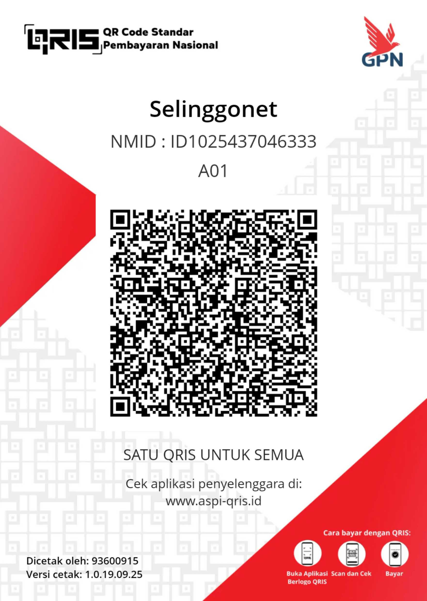

# Instalasi Aplikasi

Berikut adalah langkah-langkah untuk menginstal dan menjalankan aplikasi ini.

## 1. Clone Repository

Clone repositori ini ke mesin lokal Anda menggunakan git:

```bash
git clone https://github.com/azizt91/spreadsheet-selinggonet.git
cd spreadsheet-selinggonet
```

## 2. Konfigurasi Supabase

Aplikasi ini menggunakan Supabase sebagai backend.

### a. Buat Akun Supabase

Jika Anda belum memiliki akun, buat akun baru di [supabase.com](https://supabase.com) dan buat proyek baru.

### b. Dapatkan Kunci API Supabase

- Buka dasbor proyek Supabase Anda.
- Pergi ke **Project Settings** > **API**.
- Salin **Project URL** dan **Project API Keys** (public anon key).

### c. Perbarui Klien Supabase

Buka file `supabase-client.js` dan ganti `supabaseUrl` dan `supabaseKey` dengan kredensial yang Anda dapatkan dari dasbor Supabase.

```javascript
// supabase-client.js

const supabaseUrl = 'URL_PROYEK_SUPABASE_ANDA';
const supabaseKey = 'KUNCI_ANON_PUBLIK_ANDA';
const supabase = supabase.createClient(supabaseUrl, supabaseKey);
```

## 3. Setup Database

### a. Jalankan SQL

Buka **SQL Editor** di dasbor Supabase Anda. Buka file Database.sql copy semua query yang ada, kemudian jalankan query tersebut untuk membuat tabel dan skema yang diperlukan.

### b. Nonaktifkan Konfirmasi Email

Untuk memudahkan proses pendaftaran pengguna selama pengembangan, nonaktifkan konfirmasi email:
- Pergi ke **Authentication** -> **Providers**.
- Temukan dan matikan *toggle* **Confirm email**.

### c. Buat Storage Bucket

Aplikasi memerlukan bucket untuk menyimpan file seperti avatar pengguna.
- Pergi ke **Storage** dari menu utama.
- Klik **New bucket**.
- Isi **Bucket name** dengan `avatars`.
- Aktifkan opsi **Public bucket**.
- Klik **Create bucket**.

## 4. Deploy Supabase Functions

Deploy semua Supabase Functions yang diperlukan dengan menjalankan perintah berikut di terminal Anda. Pastikan Anda sudah menginstal Supabase CLI.

```bash
supabase functions deploy create-customer
supabase functions deploy delete-user
supabase functions deploy genieacs-proxy
supabase functions deploy send-whatsapp-notification
supabase functions deploy update-user-auth
```

Setelah menyelesaikan langkah-langkah ini, aplikasi Anda seharusnya sudah siap untuk dijalankan.

## ✨ Fitur Utama

- **Database**: Scalable & reliable
- **Authentication**: Built-in, secure & fast
- **Real-time Subscriptions**: Sinkronisasi data live
- **Edge Functions**: Serverless logic untuk proxy dan tugas lainnya

### Integrasi
- **GenieACS**: Manajemen perangkat TR-069 dari jarak jauh.
- **WhatsApp API**: Notifikasi tagihan otomatis.

### Infrastruktur
- **Service Worker**: Fungsionalitas offline dan caching untuk akses cepat.
- **Manifest**: Memberikan pengalaman seperti aplikasi native di perangkat mobile.
- **Responsive Design**: Didesain dengan pendekatan mobile-first.


## 🚀 Panduan Penggunaan

1.  **Buat Akun Admin**: Setelah aplikasi berjalan, langkah pertama adalah mendaftarkan akun baru yang akan berfungsi sebagai admin.
2.  **Kelola Paket Internet**: Sebelum menambahkan pelanggan, Anda harus menambahkan paket internet terlebih dahulu. Masuk ke menu **Pelanggan**, ketuk ikon **info (i)**, lalu pilih **Kelola Paket**.
3.  **Tambah Data Pelanggan**: Setelah paket tersedia, Anda bisa menambahkan pelanggan melalui dua cara di menu info (i) yang sama:
    *   **Import CSV**: Untuk menambahkan banyak data pelanggan sekaligus.
    *   **Tambah Pelanggan**: Untuk menginput data pelanggan satu per satu.
4.  **Kelola Tagihan**: Menu utama di bagian tengah adalah **Tagihan**. 
    *   Gunakan tombol **plus (+)** untuk membuat tagihan bulanan bagi semua pelanggan yang aktif.
    *   Pantau status tagihan melalui tiga tab: **Belum Dibayar**, **Cicilan**, dan **Dibayar**.

## Donasi

Jika Anda merasa aplikasi ini bermanfaat, Anda bisa memberikan donasi untuk membeli kopi.


